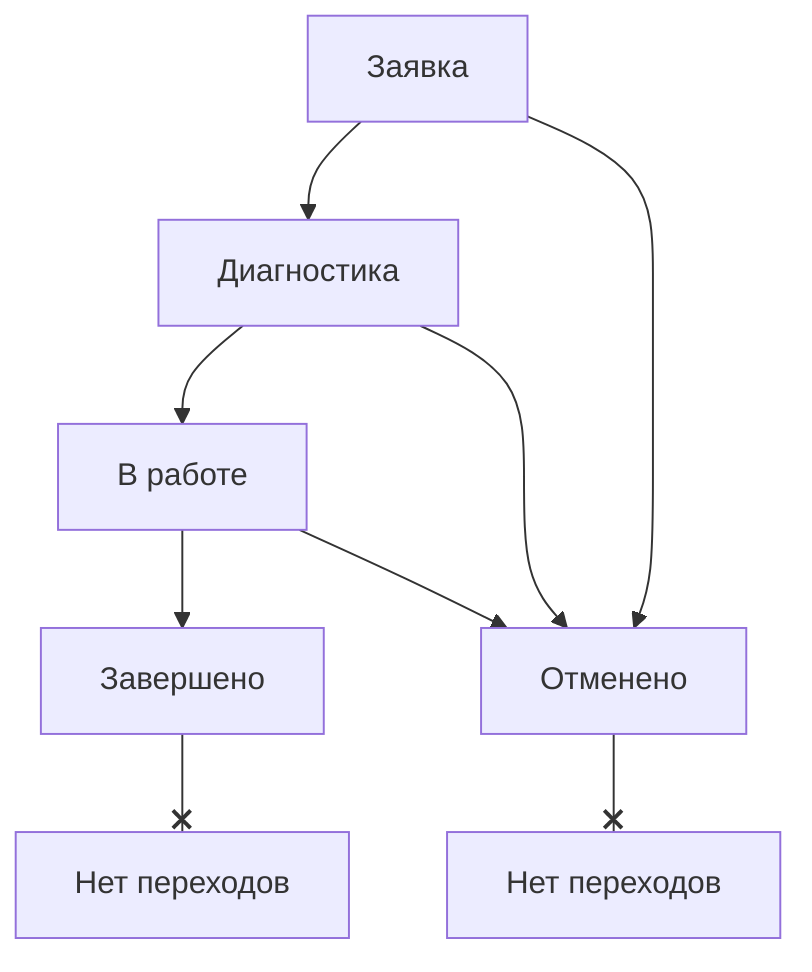

# Модуль "Оборудование": ревизия и формализация

Этот документ описывает переработанную и актуализированную структуру, модели и бизнес-логику для модуля "Оборудование", включая подсистему Технического Обслуживания (ТО).

## 1. Ключевые сущности и модели данных

Модуль базируется на нескольких ключевых сущностях, которые описывают как шаблоны оборудования, так и его конкретные экземпляры и связанные с ними процессы.

### 1.1. Тип оборудования (`EquipmentType`)

**Назначение:** Шаблон или классификатор для группы однотипного оборудования (например, "Беговая дорожка T-100", "Набор гантелей 2-20кг").

| Поле               | Тип данных         | Описание                                                |
| ------------------ | ------------------ | ------------------------------------------------------- |
| `id`               | `UUID`             | Уникальный идентификатор (PK)                           |
| `name`             | `String`           | Название типа (например, "Беговая дорожка Matrix T7xe") |
| `description`      | `String?`          | Подробное описание типа                                 |
| `category`         | `EquipmentCategory`| Категория оборудования (enum)                           |
| `weightRange`      | `String?`          | Диапазон веса (для свободных весов)                     |
| `dimensions`       | `String?`          | Габариты (ДxШxВ)                                        |
| `isMobile`         | `bool`             | Является ли оборудование мобильным                      |
| `schematicIcon`    | `String?`          | Название иконки для схематичного отображения в UI       |
| ...служебные поля  | `DateTime`, `UUID` | `createdAt`, `updatedAt`, `archivedAt` и т.д.           |

### 1.2. Экземпляр оборудования (`EquipmentItem`)

**Назначение:** Конкретная физическая единица оборудования с уникальным инвентарным номером.

| Поле                  | Тип данных        | Описание                                                     |
| --------------------- | ----------------- | ------------------------------------------------------------ |
| `id`                  | `UUID`            | Уникальный идентификатор (PK)                                |
| `typeId`              | `UUID`            | Ссылка на `EquipmentType` (FK)                               |
| `inventoryNumber`     | `String`          | Инвентарный номер (уникальный)                               |
| `serialNumber`        | `String?`         | Заводской серийный номер                                     |
| `model`               | `String?`         | Модель (может дублировать данные из типа)                    |
| `manufacturer`        | `String?`         | Производитель (может дублировать данные из типа)             |
| `roomId`              | `UUID?`           | Ссылка на помещение `Room` (FK)                              |
| `status`              | `EquipmentStatus` | Текущий статус оборудования (enum)                           |
| `conditionRating`     | `int`             | Оценка состояния (1-5 звезд)                                 |
| `purchaseDate`        | `DateTime?`       | Дата покупки                                                 |
| `photoUrls`           | `List<String>`    | Список URL-адресов фотографий (хранится в `jsonb`)          |
| ...служебные поля     | `DateTime`, `UUID`| `createdAt`, `updatedAt`, `archivedAt` и т.д.                |

### 1.3. Заявка на ТО (`EquipmentMaintenanceHistory`)

**Назначение:** Основная запись, представляющая одну заявку на техническое обслуживание.

| Поле                  | Тип данных          | Описание                                                     |
| --------------------- | ------------------- | ------------------------------------------------------------ |
| `id`                  | `UUID`              | Уникальный идентификатор (PK)                                |
| `number`              | `String?`           | Уникальный номер заявки (генерируется, "2024-001")          |
| `equipmentItemId`     | `UUID`              | Ссылка на `EquipmentItem` (FK)                               |
| `type`                | `MaintenanceType`   | Тип ТО: плановое или ремонт (enum)                           |
| `status`              | `MaintenanceStatus` | Текущий статус заявки (enum)                                 |
| `reportedProblem`     | `String`            | Описание проблемы, заявленное пользователем                  |
| `diagnosisNotes`      | `String?`           | **Новое поле.** Заметки специалиста по результатам диагностики. |
| `workDescription`     | `String?`           | Описание выполненных работ                                   |
| `reportedBy`          | `UUID`              | ID пользователя, создавшего заявку (FK `users`)              |
| `executorId`          | `UUID?`             | ID исполнителя (может ссылаться на `users` или `support_staff`)|
| `executorType`        | `ExecutorType?`     | Тип исполнителя (user/staff, enum)                           |
| `cancellationReason`  | `String?`           | Причина отмены (обязательно при статусе `cancelled`)         |
| ...служебные поля     | `DateTime`, `UUID`  | `createdAt`, `updatedAt`, `archivedAt` и т.д.                |
| ~~устаревшие поля~~   | `DateTime?`, `UUID?`| `startedAt`, `inProgressBy`, `completedAt` и т.д. - **УСТАРЕЛИ**. |

### 1.4. Запись истории статусов (`MaintenanceStatusHistoryRecord`) - **НОВАЯ СУЩНОСТЬ**

**Назначение:** Запись о каждом факте смены статуса заявки на ТО.

| Поле            | Тип данных          | Описание                                                     |
| --------------- | ------------------- | ------------------------------------------------------------ |
| `id`            | `UUID`              | Уникальный идентификатор (PK)                                |
| `maintenanceId` | `UUID`              | Ссылка на `EquipmentMaintenanceHistory` (FK)                 |
| `oldStatus`     | `MaintenanceStatus?`| Предыдущий статус (может быть `null` для первой записи)      |
| `newStatus`     | `MaintenanceStatus` | Новый установленный статус                                   |
| `comment`       | `String?`           | Комментарий к смене статуса (например, причина отмены)       |
| `changedAt`     | `DateTime`          | Точное время смены статуса                                   |
| `changedBy`     | `UUID`              | ID пользователя, сменившего статус (FK `users`)              |
| `changedByName` | `String?`           | Денормализованное имя пользователя для удобства отображения  |

## 2. Перечисления (Enums)

| Enum                  | Значения                                                      |
| --------------------- | ------------------------------------------------------------- |
| `EquipmentCategory`   | `cardio`, `strength`, `freeWeights`, `functional`, `accessories`, `measurement`, `other` |
| `EquipmentStatus`     | `available`, `inUse`, `reserved`, `maintenance`, `outOfOrder`, `storage` |
| `MaintenanceType`     | `preventive`, `corrective`                                    |
| `MaintenanceStatus`   | `reported`, `diagnosing`, `inProgress`, `completed`, `cancelled` |
| `ExecutorType`        | `user`, `supportStaff`                                        |

## 3. Основные рабочие процессы (Workflows)

### 3.1. Жизненный цикл заявки на ТО (State Machine)

*   **Заявка (`reported`)**: Начальный статус.
    *   Переход в **Диагностику** возможен после назначения исполнителя.
*   **Диагностика (`diagnosing`)**: Исполнитель осматривает оборудование.
    *   Обязательно для заполнения поле "Заметки по диагностике".
    *   Переход в **В работе** возможен после заполнения заметок.
*   **В работе (`inProgress`)**: Идет активный ремонт.
    *   Обязательно для заполнения поле "Описание выполненных работ".
    *   Переход в **Завершено** возможен после заполнения описания работ.
*   **Завершено (`completed`) / Отменено (`cancelled`)**: Финальные статусы. Дальнейшие изменения невозможны.

### 3.2. Логика истории статусов

При каждом изменении статуса заявки `EquipmentMaintenanceHistory` (при создании или обновлении) на бэкенде **автоматически** создается новая запись в таблице `maintenance_status_history`. Это обеспечивает полный и неизменяемый аудит жизненного цикла заявки.

### 3.3. Доступность полей на экране редактирования

| Поле                         | `reported` | `diagnosing` | `inProgress` | `completed` | `cancelled` |
| ---------------------------- | :--------: | :----------: | :----------: | :---------: | :---------: |
| Тип ТО, Описание проблемы    | ✅          | 🔒           | 🔒           | 🔒          | 🔒          |
| Исполнитель                  | ✅          | ✅           | 🔒           | 🔒          | 🔒          |
| **Заметки по диагностике**   | 🔒          | ✅           | ✅ (RO)      | 🔒          | 🔒          |
| **Описание выполненных работ** | 🔒          | 🔒           | ✅           | ✅ (RO)     | 🔒          |
| Причина отмены               | 🔒          | 🔒           | 🔒           | 🔒          | ✅          |
| Фото, Примечания             | ✅          | ✅           | ✅           | 🔒          | 🔒          |
| Кнопка "Сохранить"           | ✅          | ✅           | ✅           | ✅          | ✅          |

*   ✅ - Доступно для редактирования.
*   🔒 - Заблокировано.
*   RO - Read-Only после заполнения.

## 4. API Endpoints

| Метод  | Эндпоинт                               | Описание                                  |
| ------ | -------------------------------------- | ----------------------------------------- |
| `GET`  | `/api/equipment/items`                 | Получение списка экземпляров оборудования |
| `GET`  | `/api/equipment/types`                 | Получение списка типов оборудования       |
| `GET`  | `/api/maintenance`                     | Получение списка всех заявок на ТО        |
| `POST` | `/api/maintenance`                     | Создание новой заявки на ТО               |
| `GET`  | `/api/maintenance/:id`                 | Получение деталей одной заявки            |
| `PUT`  | `/api/maintenance/:id`                 | Обновление данных заявки                  |
| `GET`  | `/api/maintenance/:id/status-history`  | **НОВЫЙ.** Получение истории статусов заявки |
| `POST` | `/api/maintenance/:id/photos`          | Загрузка фото к заявке                    |

---
Этот документ служит основой для дальнейшей реализации и поддержки модуля.
