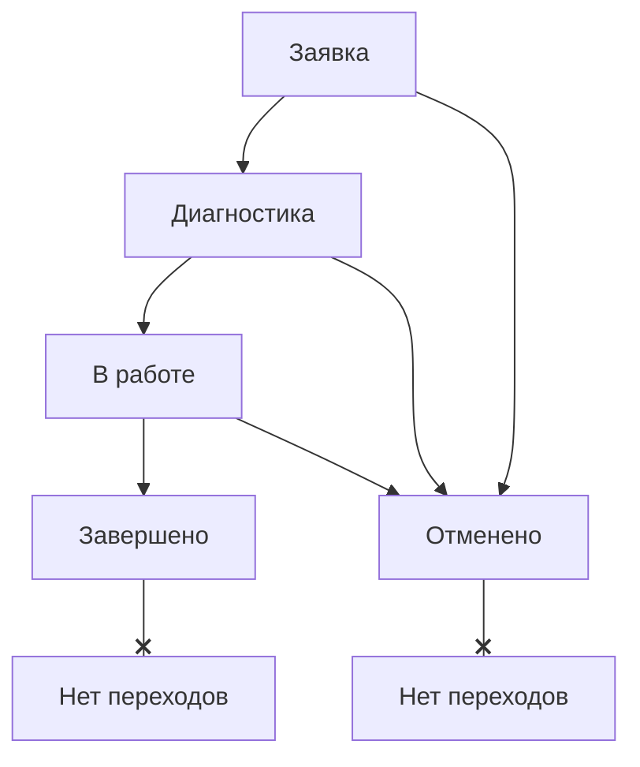

# Логика смены статусов и истории для заявок на ТО

Этот документ описывает предлагаемую логику для управления статусами заявок на техническое обслуживание (ТО) оборудования.

## 1. Статусы и переходы (State Machine)

Определены следующие статусы для заявки (`MaintenanceStatus`):

| Статус         | Enum           | Описание                                  |
| -------------- | -------------- | ----------------------------------------- |
| **Заявка**     | `reported`     | Новая заявка, созданная пользователем.    |
| **Диагностика**| `diagnosing`   | Назначен исполнитель, идет выяснение причин. |
| **В работе**   | `inProgress`   | Проводятся ремонтные работы.              |
| **Завершено**  | `completed`    | Работы выполнены, оборудование доступно.  |
| **Отменено**   | `cancelled`    | Заявка отменена по какой-либо причине.    |

**Схема разрешенных переходов:**



*   Из статуса **"Заявка"** можно перейти в "Диагностика" (при назначении исполнителя) или "Отменено".
*   Из **"Диагностика"** можно перейти в "В работе" (после описания диагноза) или "Отменено".
*   Из **"В работе"** можно перейти в "Завершено" (после описания выполненных работ) или "Отменено".
*   **"Завершено"** и **"Отменено"** — финальные статусы, из них переходы невозможны.

## 2. Доступность полей на экране редактирования

В зависимости от **текущего выбранного статуса** (`_selectedStatus`) на экране редактирования, поля будут иметь следующую доступность:

| Поле                        | `reported` | `diagnosing` | `inProgress` | `completed` | `cancelled` |
| --------------------------- | :--------: | :----------: | :----------: | :---------: | :---------: |
| Тип ТО                      | ✅          | 🔒           | 🔒           | 🔒          | 🔒          |
| Исполнитель                 | ✅          | ✅           | 🔒           | 🔒          | 🔒          |
| Описание проблемы           | ✅          | 🔒           | 🔒           | 🔒          | 🔒          |
| **Заметки по диагностике**  | 🔒          | ✅           | 🔒           | 🔒          | 🔒          |
| **Описание выполненных работ**| 🔒          | 🔒           | ✅           | 🔒           | 🔒          |
| Примечания (общие)          | ✅          | ✅           | ✅           | 🔒          | 🔒          |
| Причина отмены              | 🔒          | 🔒           | 🔒           | 🔒          | ✅ (обязательно) |
| Фото "До" / "После"         | ✅          | ✅           | ✅           | 🔒          | 🔒          |
| **Кнопка "Сохранить"**      | ✅          | ✅           | ✅           | ✅          | ✅          |

*   ✅ - Поле доступно для редактирования.
*   🔒 - Поле заблокировано (read-only).
*   **Жирным** выделены поля, которые должны быть обязательными для перехода в следующий статус.
*   Кнопка "Сохранить" всегда доступна, кроме случаев, когда заявка была открыта в уже финальном статусе.

## 3. Реализация истории статусов (Backend)

Для хранения истории будет создана новая таблица в базе данных.

**3.1. SQL-схема `maintenance_status_history`**

```sql
CREATE TABLE maintenance_status_history (
  id UUID PRIMARY KEY DEFAULT gen_random_uuid(),
  maintenance_id UUID NOT NULL REFERENCES equipment_maintenance_history(id) ON DELETE CASCADE,
  old_status SMALLINT, -- Может быть NULL для первой записи
  new_status SMALLINT NOT NULL,
  comment TEXT, -- Например, причина отмены
  changed_at TIMESTAMPTZ NOT NULL DEFAULT NOW(),
  changed_by UUID NOT NULL REFERENCES users(id)
);

CREATE INDEX idx_maintenance_status_history_maintenance_id ON maintenance_status_history(maintenance_id);
```

**3.2. Логика на бэкенде**

1.  **`MaintenanceRepository`:** Будет добавлен новый метод `addStatusHistoryRecord()`.
2.  **`MaintenanceService`:**
    *   Метод `update()` будет расширен. Перед вызовом `_maintenanceRepository.update()` он будет сравнивать старый и новый статусы.
    *   Если статус изменился, он будет вызывать `_maintenanceRepository.addStatusHistoryRecord()`, передавая ID заявки, старый и новый статусы, ID пользователя и опциональный комментарий (например, причину отмены).
    *   Метод `create()` также будет создавать первую запись в истории со статусом `reported`.
3.  **`MaintenanceController`:**
    *   Будет добавлен новый эндпоинт `GET /<id>/status-history`.
    *   Он будет вызывать соответствующий метод в сервисе для получения всех записей из `maintenance_status_history` по `maintenance_id`.

## 4. Отображение истории статусов (Frontend)

1.  **`MaintenanceStatusHistoryScreen`:** Этот экран будет переделан.
2.  **`maintenance_status_history_provider`:** Будет создан новый провайдер, который делает запрос на новый эндпоинт `GET /api/maintenance/<id>/status-history`.
3.  **`MaintenanceStatusHistoryWidget`:** Этот виджет больше не будет "симулировать" историю. Он будет получать реальный список записей из истории от нового провайдера и отображать их в `ListView`.
4.  **Отказ от полей:** Поля `startedAt`, `inProgressBy`, `completedAt`, `completedBy` и т.д. в основной записи `EquipmentMaintenanceHistory` станут **устаревшими (deprecated)**. Вся эта информация будет храниться в новой таблице и отображаться только на экране истории.

---

Прошу вас рассмотреть этот план. Если он вас устраивает, я приступлю к его реализации, начиная с модификации SQL-файла и бэкенда.
